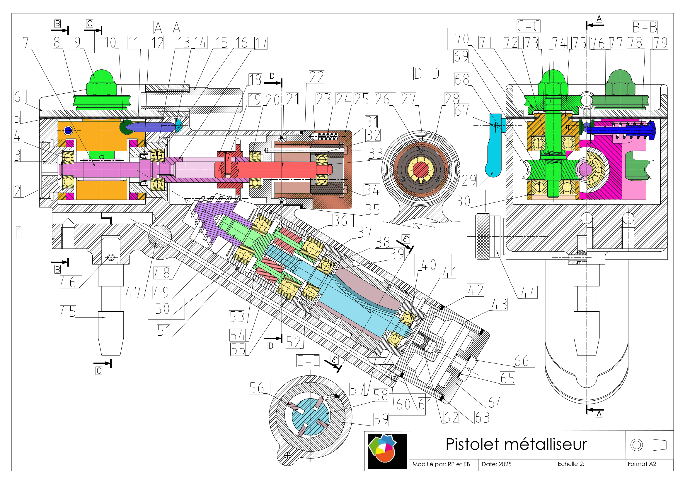

# A RENDRE LE 2 DECEMBRE  

[Dossier PA](https://external-content.duckduckgo.com/iu/?u=https%3A%2F%2Fimage.tmdb.org%2Ft%2Fp%2Foriginal%2FivvSF7erxJ6g6PHNvglrI6sQmSl.jpg&f=1&nofb=1&ipt=f320b49c1a3301ed1860e8af9c63a1dd38bd00c671050249f7935f70b5eb9f88) , 
[Lien vers cette page](https://github.com/Synbi0se/SOLIDWORKSPROJECT)

    Erreurs sur le plan :
    38 : ROULEMENT *5* 19 6
    30 : anneau 20 *1*
    52 : anneau *6 0.5*
    14 : anneau *14 0.6*

#### POUR TIMÉO
- ```1``` évacuation d'air dans le trou de droite et jsp trop
- ```22``` une horreur _a priori_, c'est une seule pièce
- ```18``` refaire c'est nul !
- ```75``` ```76```

##### POUR P-A
- Avance sur tes pièces 
- revoir les anneaux

#### SUR L'ASSEMBLAGE
- ```47``` le trou est pas en face du trou du carter
- ```69``` colision avec porte molette
- ```72``` revoir la dimension


### EXTRACTION DE PIECES :
- Arbre de la boite de vitesse ```17``` : PA
- Porte-satellites ```49``` : ??
- Réservoir ```43``` : T

### PERSPECTIVE AU CRAYON :
- Boitier ```22``` : ??
- Bouton de selection ```25``` : ??
- Réservoir ```43``` : ??

### MISE EN PLAN :
- Carter ```1``` :  PA
- Couvercle ```6``` : PA
- Corps de molette droite ```76``` : T

### REPARTITION DE LA MODELISATION DES PIECES :
<div style="display:flex;background:white;width:791px; height:15px">
<div style="background:#F02D28;width:570px"></div> <!-- Pièces réalisées x10 -->
<div style="background:#FA8072;width:40px"></div>
<div style="background:#0B55F4;width:160px"></div> <!-- Pièces réalisées par PA x10 -->
<div style="background:#8FB1FA;width:20px"></div>
</div>
73/79

--  
Hachurage simple : alliage de zinc AC41A, brut  
Hachurage double : acier allié  
Hachurage cuivre : cuivre  
Remplissage noir : _outils_, _options_, _propriété du document_, _propriété du matériau_, _remplissage_, _uni_  

|n°|nom|par|✅|n°|nom|par|✅|
|--|--|--:|--|--|--|--:|--|
|1|  Carter                           |T |~ |41| Anneau élastique 5x0.6              |PA|X |
|2|  Anneau élastique 5x0.6           |T |X |42| Bouchon                             |T |X |
|3|  Pallier de roulement             |PA|X |43| Réservoir                           |T |X |
|4|  Roulement à bille SNR 5x16x5     |T |X |44| Bouton de réglage du débit d'air    |T |X |
|5|  Joint d'étanchéité               |PA|X |45| Pivot                               |T |X |
|6|  Couvercle                        |T |X |46| Goupille élastique 3-14             |PA|X |
|7|  Vis sans fin                     |T |X |47| Corps du potentiomètre à air        |T |X |
|8|  Molette                          |T |X |48| Pignon conique à 5 roues dentées    |T |X |
|9|  Ecrou borgne M7                  |T |X |49| Porte satellite                     |PA|~ |
|10| Pion à tête conique              |T |X |50| Roulement à bille SNR 8x22x7        |T |X |
|11| Piston de réglage                |T |X |51| Calles de réglage                   |PA|X |
|12| Joint à lèvre type ET 15x9       |T |X |52| Anneau élastique 12x1               |PA|X |
|13| Roulement à billes SNR 7x19x6    |T |X |53| Couronne du réducteur               |T |X |
|14| Axe de commande                  |T |X |54| Axe de satellite                    |T |X |
|15| Guide du fil                     |T |X |55| Roulement à bille SNR 12x28x8       |T |X |
|16| Palier de roulement              |PA|X |56| Palettes                            |T |X |
|17| Arbre de la boite de vitesses    |T |X |57| Palier de roulement                 |T |X |
|18| Pignon baladeur                  |T |X |58| Arbre du moteur pneumatique         |T |X |
|19| Vis sans tête fendue à bout plat |T |X |59| Corps du moteur pneumatique         |T |~ |
|20| Roulement à bille SNR 7x19x6     |T |X |60| Vis s tête à bout plat HC M3        |T |X |
|21| Axe de selection des vitesses    |T |X |61| Calles de  réglage                  |T |X |
|22| Boîtier                          |T |X |62| Gicleur                             |T |X |
|23| Verrou                           |T |X |63| Joint d'étanchéité                  |T |X |
|24| Ressort de verrou                |T |X |64| Couvercle                           |T |X |
|25| Bouton de selection              |T |X |65| Joint d'étanchéité                  |PA|X |
|26| Tiges                            |T |X |66| Vis CL S M6                         |T |X |
|27| Tétons                           |T |X |67| Goupille élastique 2.5-8            |PA|X |
|28| Jonc                             |T |X |68| Roulement à billes SNR 7x19x6       |T |X |
|29| Manette de commande              |PA|~ |69| Roue dentée                         |T |X |
|30| Anneau élastique 20x1.2          |PA|X |70| Roulement à billes SNR 7x19x6       |T |X |
|31| Ecrou                            |T |X |71| Rondelle                            |T |X |
|32| Anneau élastique 19x1.2          |PA|X |72| Goupille élastique 2-12             |PA|X |
|33| Anneau élastique 4x0.4           |PA|X |73| Anneau élastique 7x0.8              |PA|X |
|34| Roulement à billes SNR 4x13x5    |T |X |74| Axe porte-molette                   |T |X |
|35| Calles de réglage                |PA|X |75| Corps de la molette gauche          |T |~ |
|36| Satellite                        |PA|X |76| Corps de la molette droite          |T |~ |
|37| Couvercle                        |T |X |77| Tige filetée                        |T |X |
|38| Roulement à billes SNR 7x19x6    |T |X |78| Ressort de serrage du fil           |T |X |
|39| Logement de roulement            |T |X |79| Ecrou                               |T |X |
|40| Roulement à bille SNR 5x16x5     |T |X |